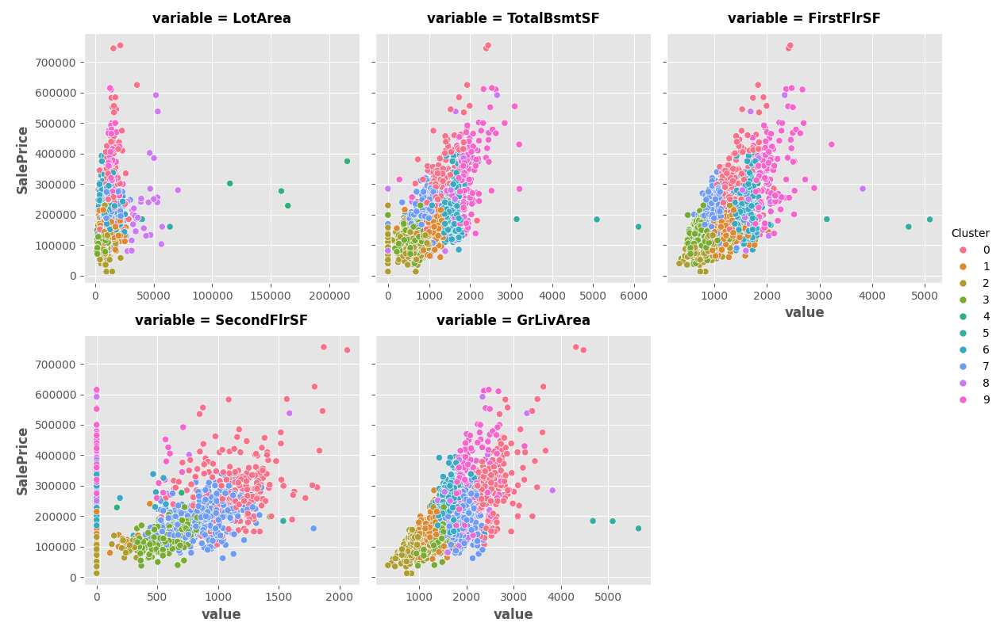

# Clustering with K-Means

This folder contains my solution to the **"Clustering with K-Means"** exercise from the [Kaggle Feature Engineering course](https://www.kaggle.com/learn/feature-engineering).

Clustering is the process of grouping data points based on similarity.  
**K-Means clustering** uses straight-line (Euclidean) distance to assign points to the nearest centroid. The number of centroids — or clusters — is defined by **k**.

---

## Exercise Steps

- Imported necessary libraries (`pandas`, `numpy`, `matplotlib`, `seaborn`, `sklearn`, and `xgboost`)
- Set default Matplotlib plot style
- Defined a custom `score_dataset()` function using cross-validation and `XGBRegressor`
- Loaded the dataset and separated the target variable (`SalePrice`)
- Selected a subset of features for clustering:
  - `['LotArea', 'TotalBsmtSF', 'FirstFlrSF', 'SecondFlrSF', 'GrLivArea']`
- Standardized the selected features
- Trained a `KMeans` model on the standardized features
- Created cluster labels and added them as a new feature (`Cluster`)
- Visualized the clustering results:

- Scored the model with the new `Cluster` feature added
- Added **cluster-distance features** using `kmeans.fit_transform()` instead of `fit_predict`
- Joined the cluster-distance features to the dataset as new columns (`Centroid_0`, `Centroid_1`, ..., `Centroid_9`)
- Scored the model again using the enriched dataset

---

## Notes

- K-Means clustering can be used as a **feature engineering technique** by either:
  - Assigning a cluster label to each observation
  - Using the **distances to all centroids** as new numerical features
- In this exercise, both strategies were tested and improved model performance was evaluated using cross-validation.

---

##  Files

clustering-k-means/
├── dataset.csv
├── clustering_kmeans.py
├── result_1.png
└── README.md
