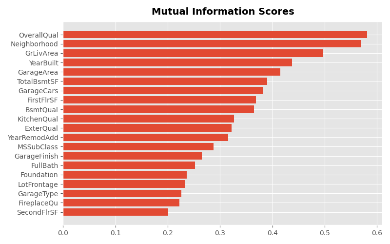
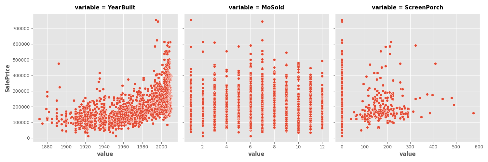
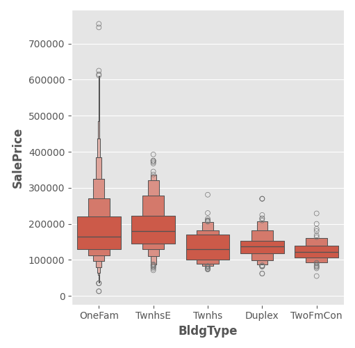
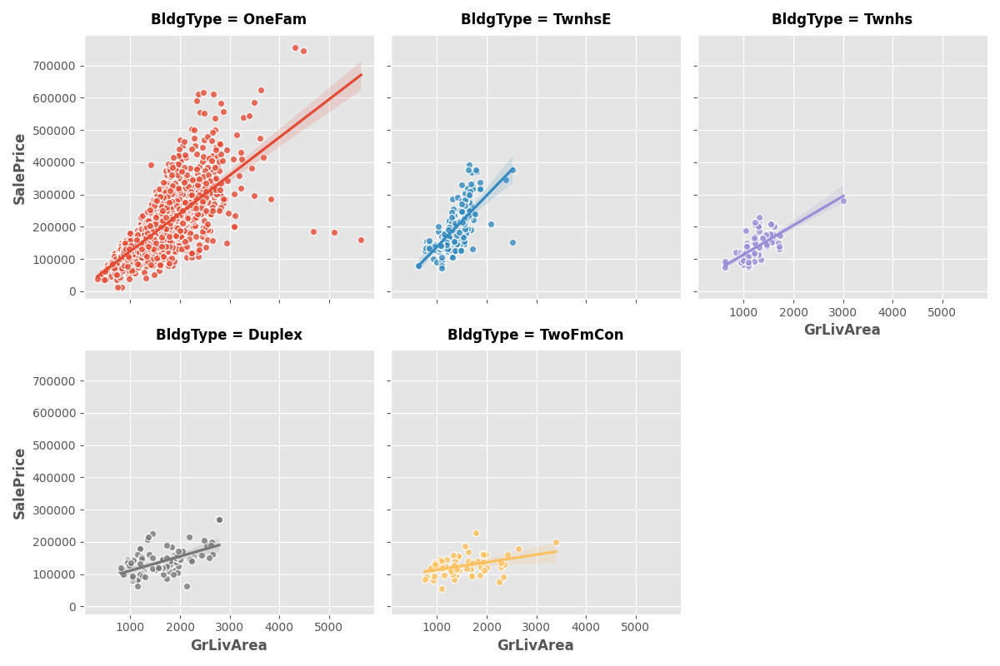
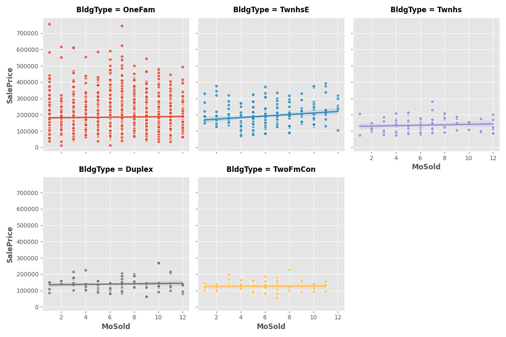

# Mutual Information

This exercise focuses on evaluating the predictive power of individual features using Mutual Information (MI).

**Steps Covered:**

*Data Preparation:*

The dataset was loaded using pandas, and categorical features were factorized to integer format to be compatible with mutual_info_regression.

*Mutual Information Computation:*

A custom function make_mi_scores() was defined to compute MI scores for all features with respect to SalePrice.

Discrete features were properly identified for accurate MI scoring.

*Visualization:*

Top 20 features were visualized using a horizontal bar chart.

A faceted scatter plot was created to explore relationships between SalePrice and selected features:

A boxen plot was generated to compare the distribution of SalePrice across different BldgType values.

*Interaction Effects:*

Using sns.lmplot, trend lines were plotted for two numerical features (GrLivArea and MoSold) conditioned on the BldgType category:

GrLivArea shows different trends across building types, suggesting a strong interaction.

MoSold shows similar trends across building types, indicating no meaningful interaction.

*Key Takeaways:*

Mutual Information (MI) is a univariate metric that ranks features based on how much information they individually provide about the target.

Interaction effects between features (e.g., BldgType and GrLivArea) can make seemingly uninformative features become valuable when considered together.

Feature selection should consider both individual feature relevance and potential interactions.

*Libraries Used*

pandas, numpy

matplotlib, seaborn

sklearn.feature_selection.mutual_info_regression
