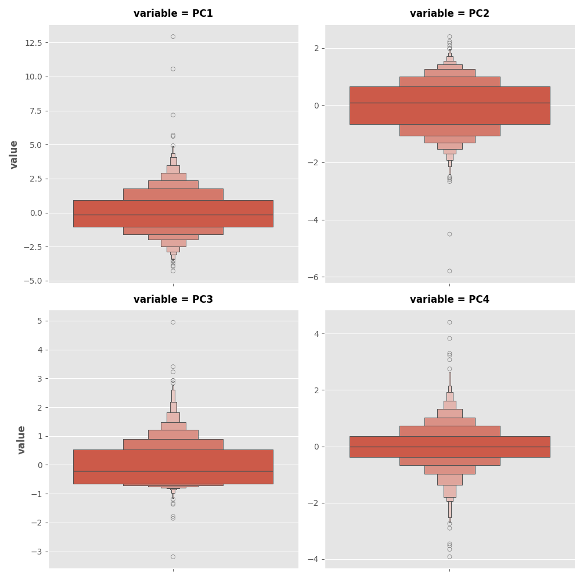

# Principal Component Analysis

This folder contains my solution to the **"Principal Componente Analysis"** exercise from the [Kaggle Feature Engineering course](https://www.kaggle.com/learn/feature-engineering).

Just like clustering is a partitioning of the dataset based on proximity, **PCA** can be seen as a partitioning of the variation in the data.
**PCA** is great to discover important relationships in the data and can be used to create more informative features.

---

## Exercise Steps

- Imported necessary libraries (`pandas`, `numpy`, `matplotlib`, `seaborn`, `sklearn`, and `xgboost`)
- Set default Matplotlib plot style
- Defined a custom `apply_pca()` function to standardize the date, create the principal componentes and the loadings
- Defined a custom `plot_variance()` function to plot the Explained Variance and the Cumulative Variance.
- Defined a custom `make_mi_scores()` function using `factorize`and `mutual_info_regression`
- Defined a custom `score_dataset()` function using cross-validation and `XGBRegressor`
- Loaded the dataset and separated the target variable (`SalePrice`)
- Selected a subset of features that are highly correlated with our target, `SalePrice`.:
- `['GarageArea', 'YearRemodAdd', 'TotalBsmtSF', 'GrLivArea']`

- Printed the correlation of the features with the `SalePrice`

GarageArea      0.640138
YearRemodAdd    0.532974
TotalBsmtSF     0.632529
GrLivArea       0.706780
dtype: float64

- Printed the loadings after apply the **PCA**

                   PC1       PC2       PC3       PC4
GarageArea    0.541229 -0.102375 -0.038470  0.833733
YearRemodAdd  0.427077  0.886612 -0.049062 -0.170639
TotalBsmtSF   0.510076 -0.360778 -0.666836 -0.406192
GrLivArea     0.514294 -0.270700  0.742592 -0.332837

- Created two new features and called the `score_dataset()` function to acess the model performance:

- `Your score:` 0.13792 RMSLE was printed

- Creates a boxen plot (a type of box plot that shows the distribution and outliers) for each principal component. Each plot shows the spread of values for one component (below).

- The principal compponent PC1 was set to analyze.

- Selected principal component in descending order and get the corresponding row indices.
- Printe the original DataFrame rows, ordered by the selected principal component, showing the columns "SalePrice", "Neighborhood", "SaleCondition", and the features selected earlier.

      SalePrice            Neighborhood SaleCondition  GarageArea  YearRemodAdd  TotalBsmtSF  GrLivArea
1498     160000                 Edwards       Partial      1418.0          2008       6110.0     5642.0
2180     183850                 Edwards       Partial      1154.0          2009       5095.0     5095.0
2181     184750                 Edwards       Partial       884.0          2008       3138.0     4676.0
1760     745000              Northridge       Abnorml       813.0          1996       2396.0     4476.0
1767     755000              Northridge        Normal       832.0          1995       2444.0     4316.0
...         ...                     ...           ...         ...           ...          ...        ...
662       59000                Old_Town        Normal         0.0          1950        416.0      599.0
2679      80500               Brookside        Normal         0.0          1950          0.0      912.0
2879      51689  Iowa_DOT_and_Rail_Road       Abnorml         0.0          1950          0.0      729.0
780       63900                  Sawyer        Normal         0.0          1950          0.0      660.0
1901      39300               Brookside        Normal         0.0          1950          0.0      334.0

[2930 rows x 7 columns]

## Notes

PCA is sensitive to the scale of the variables. When data is standardized (each feature has mean 0 and variance 1), PCA analyzes the correlation matrix, so "variation" refers to the correlation between features. This means PCA finds directions that explain the most shared variation, regardless of the original units.

With unstandardized data, PCA uses the covariance matrix, so "variation" refers to the actual covariances, which are influenced by the scale of each variable. In this case, features with larger scales or variances will dominate the principal components, potentially masking relationships between features with smaller variances.

Instead of describing the data with the original features, we describe it with its axes of variation. The axes of variation become the new features.

The new features PCA constructs are actually just linear combinations (weighted sums) of the original features.

These new features are called the principal components of the data. The weights themselves are called loadings. There will be as many principal components as there are features in the original dataset.

##  Files

principal-componente-analysis/
├── dataset.csv
├── principal_componente_analysis.py
├── result_1.png
└── README.md