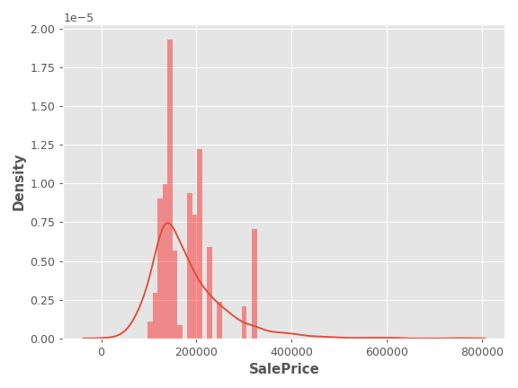
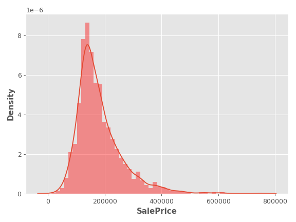

# Target Encoding 

This folder contains my solution to the **Target Encoding** exercise from the [Kaggle Feature Engineering course](https://www.kaggle.com/learn/feature-engineering).

`Target Encoding` replaces each category in a feature with a numerical value derived from the target variable — for example, the mean target value for each category..

---

## Workflow Overview

**Setup**

- Imported essential libraries: `pandas`, `numpy`, `matplotlib`, `seaborn`, `sklearn`, `category_encoders` and `xgboost`
- Set default Matplotlib plot style for consistent plot formatting
- Defined custom functions:
      - `score_dataset()`: Evaluates model performance using cross-validation and `XGBRegressor` returning RMSLE (Root Mean Squared Log Error).

**Data Exploration**

- Loaded the dataset
- Counted the number of categories for each categorical feature (table below).

| Feature          | Categories |
|------------------|------------|
| MSSubClass       | 16         |
| MSZoning         | 7          |
| Street           | 2          |
| Alley            | 3          |
| LotShape         | 4          |
| LandContour      | 4          |
| Utilities        | 3          |
| LotConfig        | 5          |
| LandSlope        | 3          |
| Neighborhood     | 28         |
| Condition1       | 9          |
| Condition2       | 8          |
| BldgType         | 5          |
| HouseStyle       | 8          |
| OverallQual      | 10         |
| OverallCond      | 9          |
| RoofStyle        | 6          |
| RoofMatl         | 8          |
| Exterior1st      | 16         |
| Exterior2nd      | 17         |
| MasVnrType       | 4          |
| ExterQual        | 4          |
| ExterCond        | 5          |
| Foundation       | 6          |
| BsmtQual         | 6          |
| BsmtCond         | 6          |
| BsmtExposure     | 5          |
| BsmtFinType1     | 7          |
| BsmtFinType2     | 7          |
| Heating          | 6          |
| HeatingQC        | 5          |
| CentralAir       | 2          |
| Electrical       | 6          |
| KitchenQual      | 5          |
| Functional       | 8          |
| FireplaceQu      | 6          |
| GarageType       | 7          |
| GarageFinish     | 4          |
| GarageQual       | 6          |
| GarageCond       | 6          |
| PavedDrive       | 3          |
| PoolQC           | 5          |
| Fence            | 5          |
| MiscFeature      | 5          |
| SaleType         | 10         |
| SaleCondition    | 6          |

- Checked category frequency for `SaleType`:

| Category | Count |
|----------|-------|
| WD       | 2536  |
| New      | 239   |
| COD      | 87    |
| ConLD    | 26    |
| CWD      | 12    |
| ConLI    | 9     |
| ConLw    | 8     |
| Oth      | 7     |
| Con      | 5     |
| VWD      | 1     |

**Encoding Workflow**

- Selected Neighborhood as the feature to encode.

- Split the data:

- Encoding split: 20% of the dataset (used to fit the encoder).

- Training split: remaining 80%.

- Created an MEstimateEncoder with m=1.0 smoothing.

- Fitted the encoder on the encoding split and transformed the training split.

- Plotted the distribution of the target (SalePrice) vs. the encoded values:

**Performance Comparison**

- The score of the encoded set was compared to the original set:

Baseline Score (no encoding): 0.1434 RMSLE
Score with Encoding: 0.1434 RMSLE (no improvement in this case).

**Additional Experiment**

- Created a synthetic feature "Count" (mostly unique values).

- Applied MEstimateEncoder with no smoothing (m=0) to "Count".

- Evaluated the transformed dataset:

Score: 0.0375 RMSLE (due to data leakage, since the encoder was fitted and transformed on the same data).

- Compared the target distribution (blue KDE) with the encoded "Count" distribution (red histogram):

## Notes

- Feature choice matters: Target encoding is most useful for high-cardinality categorical features.

- Smoothing: M-estimate encoding uses smoothing to stabilize values for rare categories.

- Avoiding overfitting: Always fit the encoder on a separate holdout split, not on the same data you train the model with.

- Performance changes: Encoding can help or hurt performance depending on how much useful signal is in the encoded feature.

- Data leakage risk: Encoding a feature on the full dataset before splitting can give unrealistically low error (as in the "Count" example).

