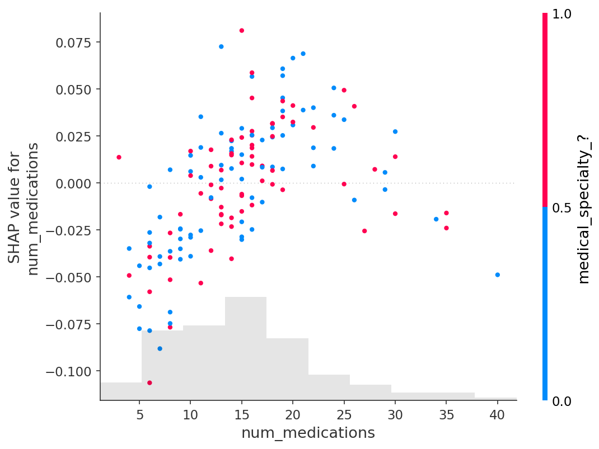

## Advanced Uses of SHAP Values

This folder contains my solution to the **"Advanced Uses of SHAP Values"** exercise from the [Kaggle Machine Learning Explainability Course](https://www.kaggle.com/learn/machine-learning-explainability).

## Workflow Summary

- Imported all required libraries

- Loaded the dataset `train.csv`

- Extracted the target variable `readmitted` into a separate series `y`

- With a list base_features  created the feature matrix `X` as floats

- Split the dataset into training and validation sets using `train_test_split`

- Trained a baseline model with `RandomForestClassifier` using `fit()`

- Initialized a SHAP explainer and generated SHAP values to quantify the contribution of each feature to the model’s predictions.

- Extracted SHAP values for the target class (readmitted = 1) by slicing the explanation object (sv[:, :, cls_idx]).

- Generated a SHAP beeswarm plot to visualize the distribution and relative importance of feature contributions across multiple validation sample

- Created the SHAP dependence contribution plots for `um_medications`

## Key Takeaways

- SHAP plots show the distribution and direction of feature effects across samples.

- Wide SHAP ranges can sometimes be caused by outliers, so they don’t always mean “important.”

- Permutation Importance better reflects a feature’s general importance for model accuracy.

- Combining both gives the full picture: PI for “how much it matters,” SHAP for “how it matters