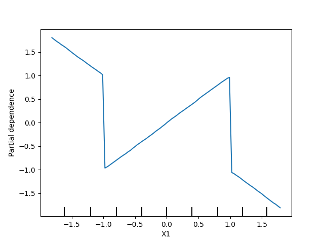

## Partial Plots

This folder contains my solution to the **"Partial Plots"** exercise from the [Kaggle Machine Learning Explainability Course](https://www.kaggle.com/learn/machine-learning-explainability).

While feature importance shows what variables most affect predictions, partial dependence plots show how a feature affects predictions. E.g: how would similarly sized houses be priced in different areas.

Like Permutation Importance, Partial dependence plots are calculated after a model has been fit.

## Workflow Summary

- Imported all required libraries

- Loaded and cleaned the dataset:
  - Removed extreme outliers and invalid fare values

- Extracted the target variable `fare_amount` into a separate series `y`

- Defined a list of base features and created the feature matrix `X`

- Split the dataset into training and validation sets using `train_test_split`

- Trained a baseline model with `RandomForestRegressor` using `fit()`

- Displayed the first rows of the cleaned dataset for inspection

**Sample of cleaned data:**

| fare_amount | pickup_datetime       | pickup_longitude | pickup_latitude | dropoff_longitude | dropoff_latitude | passenger_count |
|-------------|------------------------|------------------|------------------|--------------------|------------------|------------------|
| 5.7         | 2011-08-18 00:35:00 UTC | -73.982738       | 40.761270        | -73.991242         | 40.750562        | 2                |
| 7.7         | 2012-04-21 04:30:42 UTC | -73.987130       | 40.733143        | -73.991567         | 40.758092        | 1                |
| ...         | ...                    | ...              | ...              | ...                | ...              | ...              |

- Used `describe()` to understand feature distribution in the cleaned dataset

- Used `PartialDependenceDisplay.from_estimator` to analyze the base features (plots below).

    - Shows how each feature individually influences the model predictions.

    - Visualizes the Partial Dependence Plots (PDP).

- Visualizes a 2D plot between pickup longitude and dropoff longitude features

- Visualize the Partial Dependence Plots with two new features(the absolut variations in latitude and longitude)

- Visualize the Partial Dependence Plots created with two features, `X1` and `X2`, having random values in the range [-2, 2].

