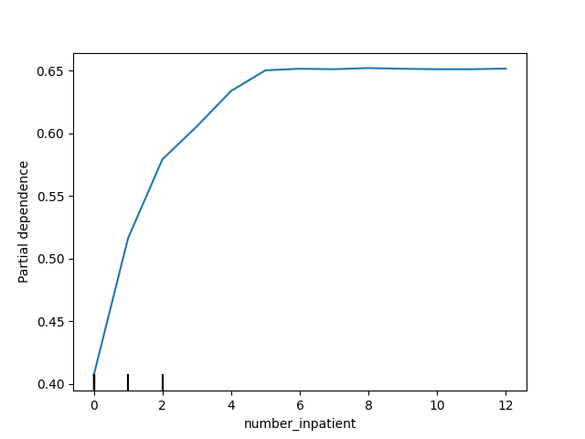

## SHAP Values

This folder contains my solution to the **"SHAP Values"** exercise from the [Kaggle Machine Learning Explainability Course](https://www.kaggle.com/learn/machine-learning-explainability).

SHAP Values (an acronym from SHapley Additive exPlanations) break down a prediction to show the impact of each feature

SHAP values interpret the impact of having a certain value for a given feature in comparison to the prediction we'd make if that feature took some baseline value

## Workflow Summary

- Imported all required libraries

- Loaded the dataset

- Exhibit the dataset columns  

Index(['time_in_hospital', 'num_lab_procedures', 'num_procedures',
       'num_medications', 'number_outpatient', 'number_emergency',
       'number_inpatient', 'number_diagnoses', 'race_Caucasian',
       'race_AfricanAmerican', 'gender_Female', 'age_[70-80)', 'age_[60-70)',
       'age_[50-60)', 'age_[80-90)', 'age_[40-50)', 'payer_code_?',
       'payer_code_MC', 'payer_code_HM', 'payer_code_SP', 'payer_code_BC',
       'medical_specialty_?', 'medical_specialty_InternalMedicine',
       'medical_specialty_Emergency/Trauma',
       'medical_specialty_Family/GeneralPractice',
       'medical_specialty_Cardiology', 'diag_1_428', 'diag_1_414',
       'diag_1_786', 'diag_2_276', 'diag_2_428', 'diag_2_250', 'diag_2_427',
       'diag_3_250', 'diag_3_401', 'diag_3_276', 'diag_3_428',
       'max_glu_serum_None', 'A1Cresult_None', 'metformin_No',
       'repaglinide_No', 'nateglinide_No', 'chlorpropamide_No',
       'glimepiride_No', 'acetohexamide_No', 'glipizide_No', 'glyburide_No',
       'tolbutamide_No', 'pioglitazone_No', 'rosiglitazone_No', 'acarbose_No',
       'miglitol_No', 'troglitazone_No', 'tolazamide_No', 'examide_No',
       'citoglipton_No', 'insulin_No', 'glyburide-metformin_No',
       'glipizide-metformin_No', 'glimepiride-pioglitazone_No',
       'metformin-rosiglitazone_No', 'metformin-pioglitazone_No', 'change_No',
       'diabetesMed_Yes', 'readmitted'],
      dtype='object')

- Extracted the target variable `readmitted` into a separate series `y`

- With the features different from `readmitted` created the feature matrix `X`

- Split the dataset into training and validation sets using `train_test_split`

- Trained a baseline model with `RandomForestRegressor` using `fit()`

- Created a `PermutationImportance` object on the baseline model and displayed importances using `eli5.explain_weights()` and `format_as_text`.

0.0451 ± 0.0068  number_inpatient
0.0087 ± 0.0046  number_emergency
0.0062 ± 0.0053  number_outpatient
0.0033 ± 0.0016  payer_code_MC
0.0020 ± 0.0016  diag_3_401
0.0016 ± 0.0031  medical_specialty_Emergency/Trauma
0.0014 ± 0.0024  A1Cresult_None
0.0014 ± 0.0021  medical_specialty_Family/GeneralPractice
0.0013 ± 0.0010  diag_2_427
0.0013 ± 0.0011  diag_2_276
0.0011 ± 0.0022  age_[50-60)
0.0010 ± 0.0022  age_[80-90)
0.0007 ± 0.0006  repaglinide_No
0.0006 ± 0.0010  diag_1_428
0.0006 ± 0.0022  payer_code_SP
0.0005 ± 0.0030  insulin_No
0.0004 ± 0.0028  diabetesMed_Yes
0.0004 ± 0.0021  diag_3_250
0.0003 ± 0.0018  diag_2_250
0.0003 ± 0.0015  glipizide_No
                       … 44 more …  

- Visualizes the Partial Dependence Plots (PDP). Show how num_inpatient affects the model's predictions.

