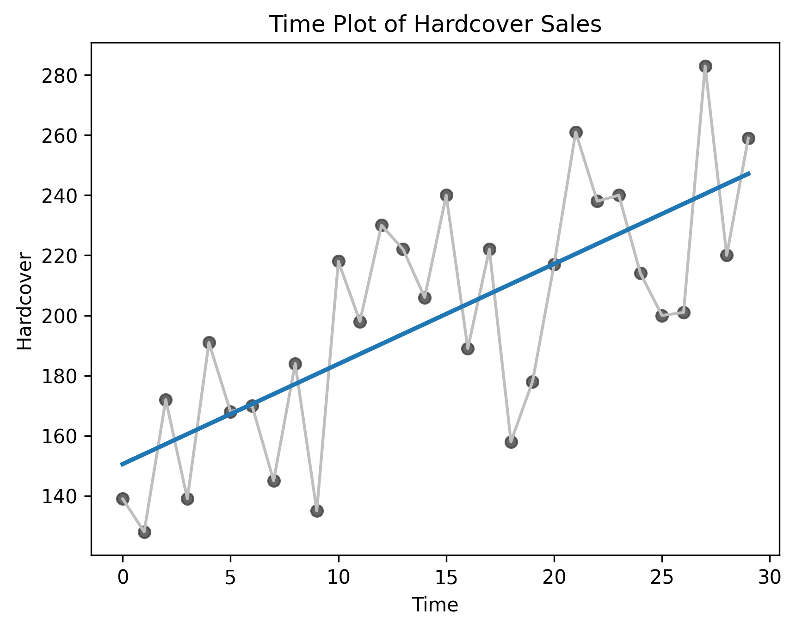
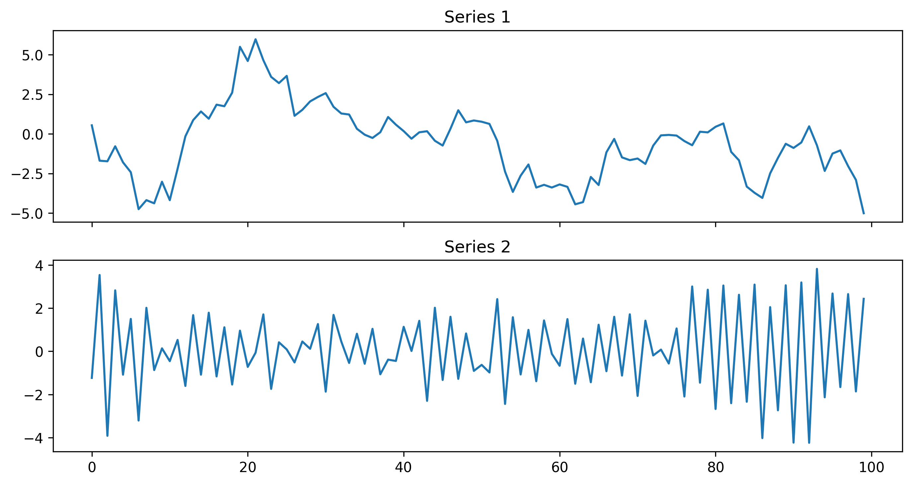
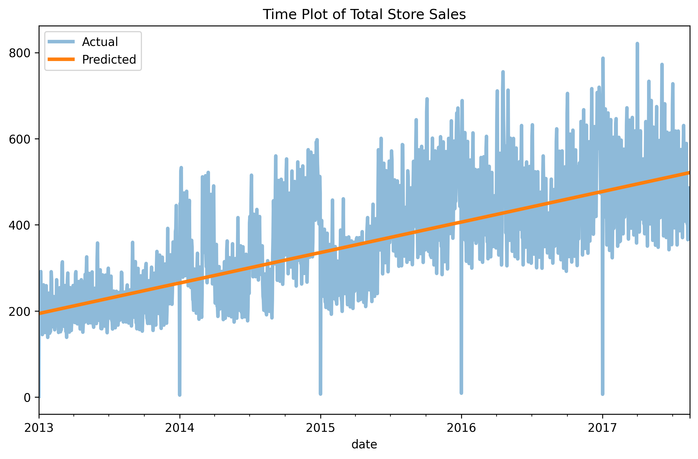
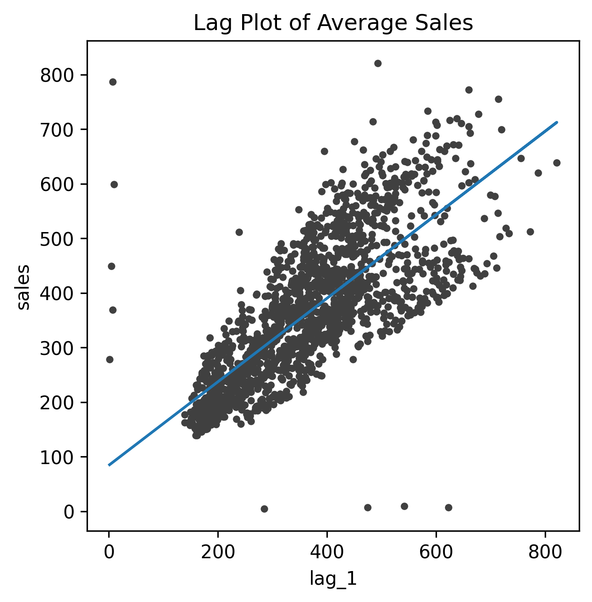

## Linear Regression With Time Series

This folder contains my solution to the **"Linear Regression With Time Series"** exercise from the [Kaggle Time Series Course](https://www.kaggle.com/learn/time-series).

This project demonstrates how to use linear regression models to analyze and predict time series data.

---

## Workflow Summary

- **Import libraries**

- **Book Sales Dataset**
  - Load book sales data with "Date" as the index (parsed as datetime).
  - Drop the "Paperback" column to focus only on "Hardcover".
  - Add a time index (0, 1, 2, …) to represent the passage of time.
  - Create a lag feature (`Lag_1` = previous day's sales).
  - Reorder columns for clarity.

- **Autoregressive Toy Dataset**
  - Load toy autoregressive dataset (`ar.csv`) containing two sample series.

- **Store Sales Dataset**
  - Load daily sales data with optimized dtypes for efficiency.
  - Convert the index to a daily `PeriodIndex`.
  - Add store number and product family as additional index levels (MultiIndex).
  - Aggregate mean sales across all stores/families per day.

---

## Experiments

**1. Linear regression on Hardcover sales**

- Visualize trend in Hardcover book sales using regression line.  

---

**2. Autoregressive toy series**

- Plot two synthetic AR series from the dataset.  

---

**3. Linear regression with time as a feature (trend model)**

- Create a "time" dummy variable (increasing counter).
- Train a regression model to predict sales based on time alone.
- Compare actual vs predicted sales over time.  

---

**4. Linear regression with lag feature (autoregression model)**

- Use lagged sales (yesterday’s sales) as predictor.
- Train regression model to predict today’s sales.
- Compare actual vs predicted values in lag space.  

---

## Key Takeaways

- Linear regression in time series can use **two types of features**:
  - **Time-step features**: derived directly from the time index (e.g., a simple counter, month, weekday).  
  - **Lag features**: past values of the target used to predict the current value.  

- **Ordinary Least Squares (OLS)** regression estimates parameters (weights and bias) by minimizing squared error between predictions and true values.  
  - Weights = regression coefficients (effect of features).  
  - Bias = intercept (y-axis crossing point).  

- **Trend model (time-step feature)** captures long-term patterns.  
- **Lag model (autoregression)** captures short-term dependencies.  
- Combining both types of features is often necessary for real-world forecasting tasks.  

---

