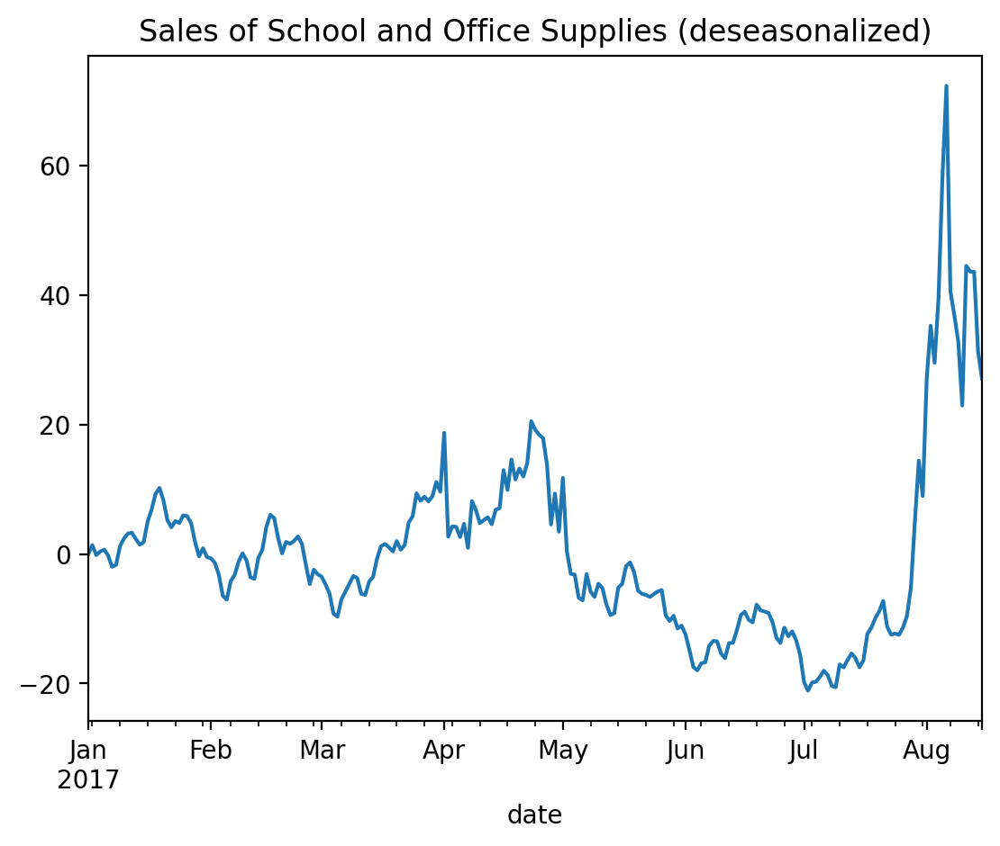
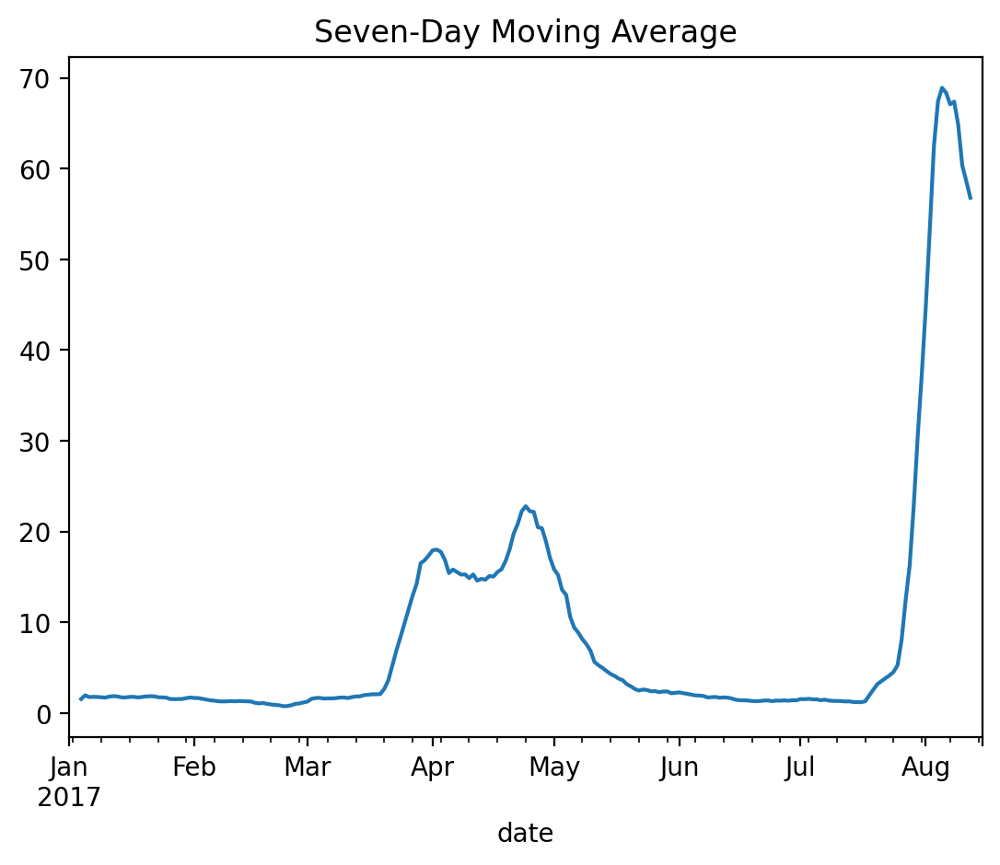
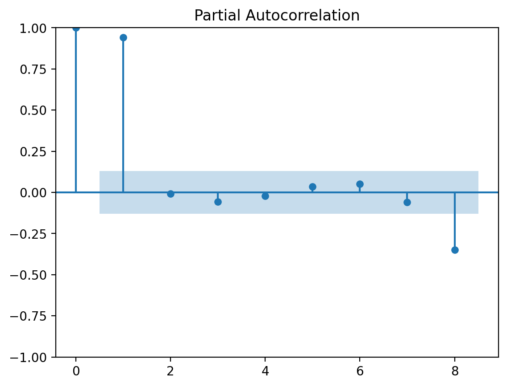
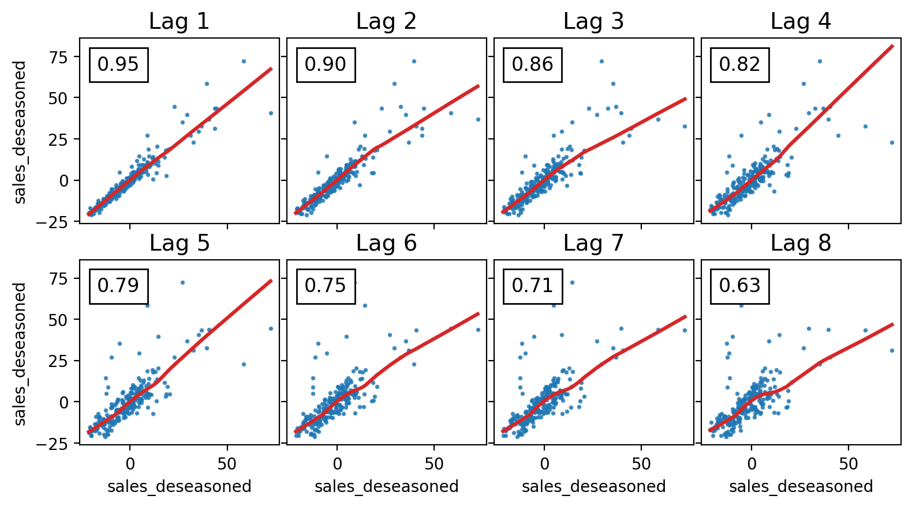
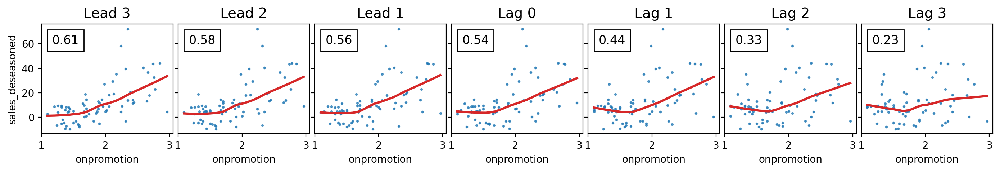
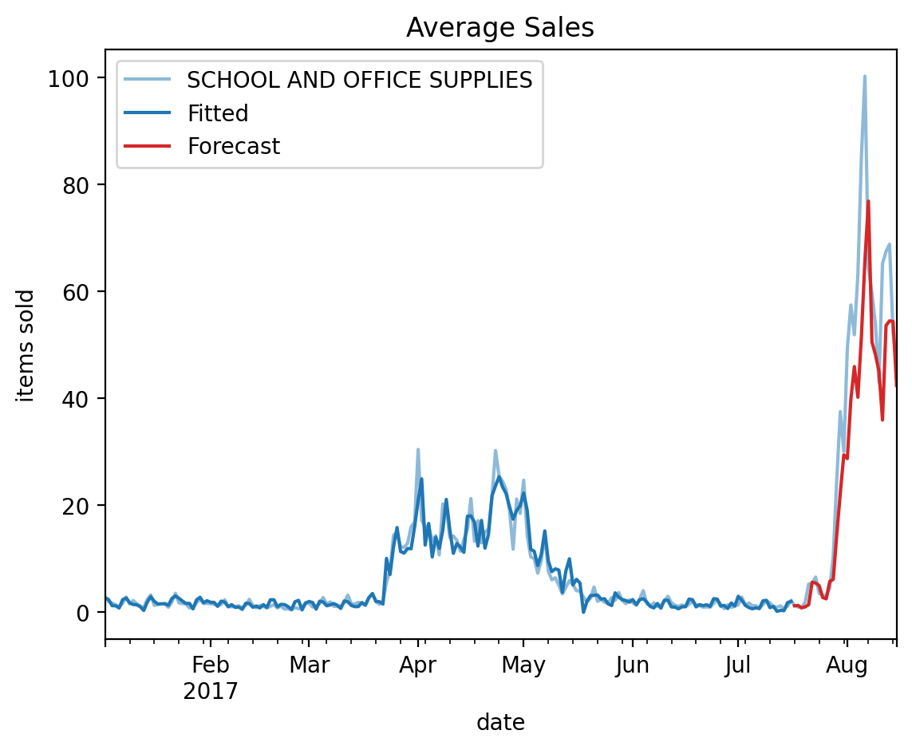
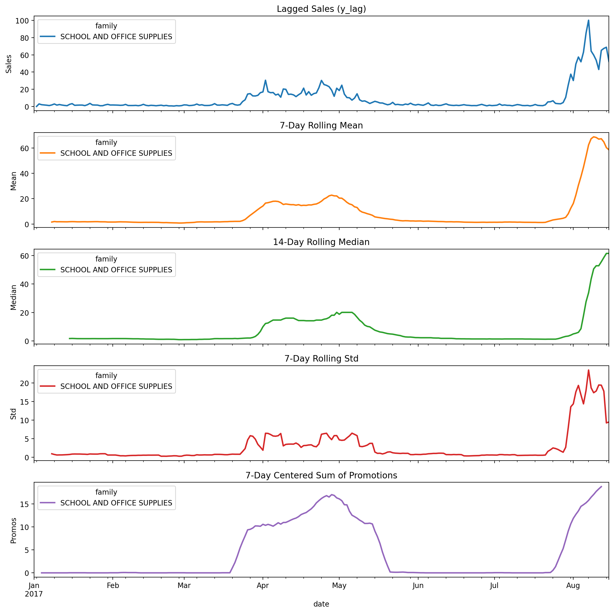

## Time Series as Features

This folder contains my solution to the **"Time Series as Features"** exercise from the [Kaggle Time Series Course](https://www.kaggle.com/learn/time-series).

The project demonstrates how to predict the future from the past using lag/lead features and seasonal regressors.

---

## Workflow Summary

- **Import libraries**  
  Load Python libraries for data manipulation (`pandas`, `numpy`), visualization (`matplotlib`, `seaborn`), and modeling (`scikit-learn`, `statsmodels`).

- **Load datasets**  
  Import `train.csv` (store sales data on  https://www.kaggle.com/learn/time-series), preprocess dates, and create a daily `PeriodIndex`.

- **Deseasonalize the series**  
  Focus on the *School and Office Supplies* family. Remove trend/seasonality using dummy and Fourier terms.

- **Moving average**
  Compute a 7-day moving average to smooth fluctuations and reveal cycles.

- **Partial autocorrelation (PACF)**
  Analyze serial dependence; significant lags are visible at lag 1 and lag 8.

 - **Lag Plots**
  Visualize deseasonalized sales against lagged values. Patterns appear mostly linear.

- **Lead & Lag Plots**
  Compare `onpromotion` leads/lags with sales. Both directions show correlation, suggesting useful predictive features.

- **Feature creation & modeling**  
  Construct time features from deseasonalized sales and `onpromotion`. Train a regression model on 2017 data, holding out the last 30 days.  
  - Training RMSLE: **0.23893**  
  - Validation RMSLE: **0.34245**
  
- **Statistical rolling features**  
  Compute 7-day rolling mean/std, 14-day rolling median, and 7-day centered promotion sum.
---

## Key Takeaways

- Some time series properties can only be modeled as **serial dependence** (dependence on past values), not just time-based trends.  
- Structure not visible in a line plot may become clear in lag plots or PACF.  
- Lagged target values and leading indicators (like promotions) are powerful features.  
- Cyclic patterns can be captured through rolling statistics and autocorrelation.

---

## Visualizations

### Deseasonalized Series
Isolates cyclic behavior.  

### Moving Average
7-day moving average smoothing.  

### Partial Autocorrelation
PACF of deseasonalized sales.  

### Lag plots
Sales vs lagged values.  

### Lead & Lag of Promotions
Promotions vs sales with leads/lags.  

## Forecast
Observed vs fitted vs forecast (last 30 days).  

### Rolling Statistical Features
Exploration of mean, median, std, and promo sums.  
