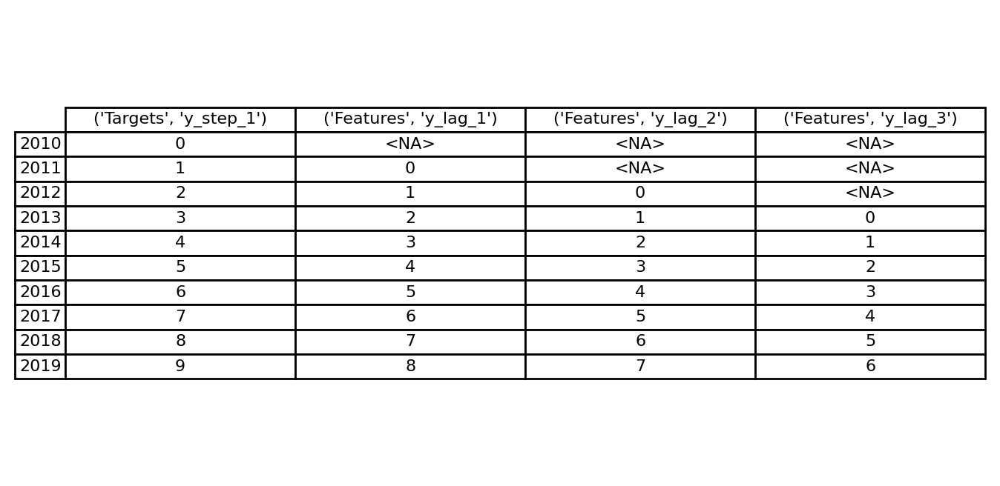
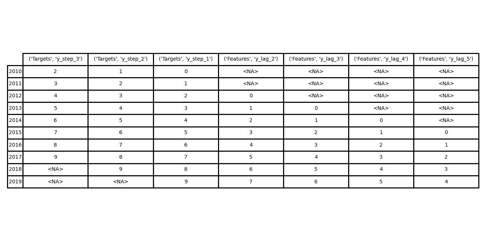
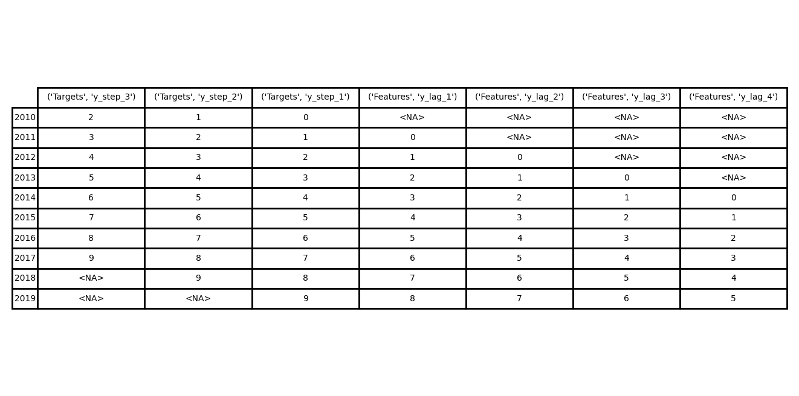
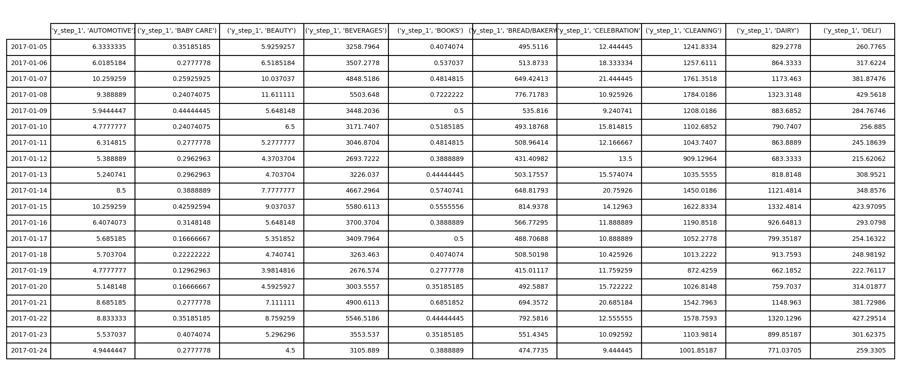
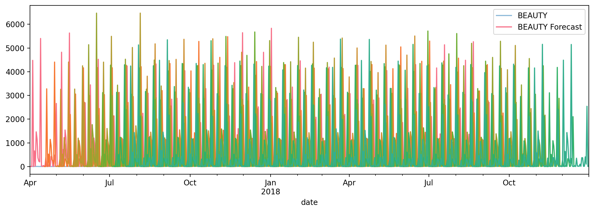

## Forecasting With Machine Learning

This folder contains my solution to the **"Forecasting With Machine Learning"** exercise from the [Kaggle Time Series Course](https://www.kaggle.com/learn/time-series).

The project demonstrates how to apply ML to any forecasting task.

## Definitions

The forecast origin is time at which you are making a forecast (the last time for which you have training data) 

The forecast horizon is the time for which you are making a forecast - the number of time steps in its horizon: e.g a "5-step" forecast - it describes the target.

The time between the origin and the horizon is the lead time (or sometimes latency) of the forecast, e.g:  "3-step ahead" forecast .

Multioutput model - Use a model that produces multiple outputs naturally. Linear regression and neural networks can, XGBoost can't.

Direct strategy - Train a separate model for each step in the horizon: one model forecasts 1-step ahead, another 2-steps ahead, and so on.
Training lots of models can be computationally expensive.

Recursive strategy- Train a single one-step model and use its forecasts to update the lag features for the next step. 
We only need to train one model, but since errors will propagate from step to step, forecasts can be inaccurate for long horizons.

DirRec strategy - A combination of the direct and recursive strategies: train a model for each step and use forecasts from previous steps as new lag features. 
Step by step, each model gets an additional lag input. Since each model always has an up-to-date set of lag features, the DirRec strategy can capture serial 
dependence better than Direct, but it can also suffer from error propagation like Recursive.

## Workflow Summary

**Import libraries**
Load Python libraries for data manipulation (`pandas`), visualization (`matplotlib`), and modeling (`scikit-learn`, `statsmodels`, `xgboost`).

**Load datasets**
Import `train.csv` (store sales data on https://www.kaggle.com/learn/time-series). 
Preprocess dates into a daily `PeriodIndex`, and set a hierarchical index (store_nbr, family, date).

Import `test.csv`.

**Visualization**
Visualize each of the following three datasets:
a. 3-step forecast using 4 lag features with a 2-step lead time
b. 1-step forecast using 3 lag features with a 1-step lead time
c. 3-step forecast using 4 lag features with a 1-step lead time

**Show training and test datasets**

Training Data 
-------------
                                      sales  onpromotion
store_nbr family     date                              
1         AUTOMOTIVE 2013-01-01   0.000000            0
                     2013-01-02   2.000000            0
                     2013-01-03   3.000000            0
                     2013-01-04   3.000000            0
                     2013-01-05   5.000000            0
...                                    ...          ...
9         SEAFOOD    2017-08-11  23.830999            0
                     2017-08-12  16.859001            4
                     2017-08-13  20.000000            0
                     2017-08-14  17.000000            0
                     2017-08-15  16.000000            0

[3000888 rows x 2 columns]

Test Data 
---------
                                       id  onpromotion
store_nbr family     date                            
1         AUTOMOTIVE 2017-08-16  3000888            0
                     2017-08-17  3002670            0
                     2017-08-18  3004452            0
                     2017-08-19  3006234            0
                     2017-08-20  3008016            0
...                                  ...          ...
9         SEAFOOD    2017-08-27  3022271            0
                     2017-08-28  3024053            0
                     2017-08-29  3025835            0
                     2017-08-30  3027617            0
                     2017-08-31  3029399            0

[28512 rows x 2 columns]

**Create multistep dataset for Store Sales**
Create targets suitable for the *Store Sales* forecasting task. Use 4 days of lag features. 
Drop any missing values from both targets and features.

**DirRec strategy**
Apply the DirRec strategy to the multiple time series of Store Sales
Prepare the data for XGBoost.

**Visualize**
Show the data prepared for XGBoost.

**Forecast**
Forecast with the DirRec strategy. Instantiate a model that applies the DirRec strategy to XGBoost.
Train the model

**Show Predictions**
See a sample of the 16-step predictions this model makes on the training data.

