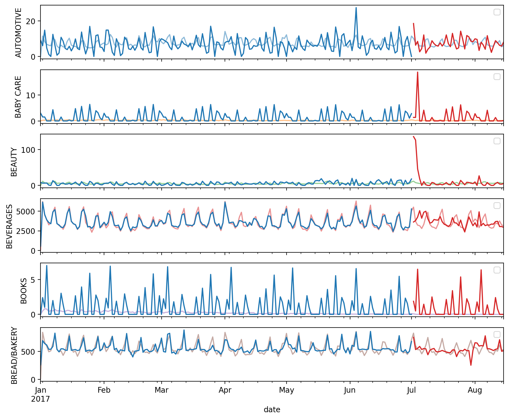

## Hybrid Model

This folder contains my solution to the **"Hybrid Models"** exercise from the [Kaggle Time Series Course](https://www.kaggle.com/learn/time-series).

The project demonstrates how to combine a statistical model (linear regression on deterministic trends) with a machine learning model (`XGBoost` on residuals) to improve forecasts.

## Workflow Summary

**Import libraries**
Load Python libraries for data manipulation (`pandas`), visualization (`matplotlib`), and modeling (`scikit-learn`, `statsmodels`, `xgboost`).

**Load datasets**
Import `train.csv` (store sales data on https://www.kaggle.com/learn/time-series). 
Preprocess dates into a daily `PeriodIndex`, and set a hierarchical index (store_nbr, family, date).

**Aggregate sales**
Compute daily average sales by product family. Restrict analysis to 2017.

**Hybrid model definition**

`model_1`: Linear Regression fitted on deterministic time features (trend).

`model_2`: XGBoost fitted on residuals, using promotions, product family, and day-of-month as features.

Predictions = model_1 (baseline) + model_2 (residual corrections).

**Feature engineering**

Deterministic process (trend).

`onpromotion` stacked by family.

Encoded product family (`LabelEncoder`).

Day of month from index.

**Train/validation split**
Train on data up to 2017-07-01, validate on later dates.

**Model fitting and prediction**
Fit `BoostedHybrid` with `LinearRegression` and `XGBRegressor`. Generate predictions, clipping at 0 (sales ≥ 0).

**Visualization**
Plot actual vs fitted vs predicted sales for the first six families. Save results to `prediction_hybrid.png`.

## Key Takeaways

A hybrid approach improves forecasts: deterministic regressors capture overall trend, while boosting learns nonlinear effects.

Residual modeling is powerful: what the first model misses can be learned by a second, more flexible one.

Encoding categorical features (family) and using calendar effects (day) enhances predictive performance.

Clipping predictions avoids invalid negative forecasts for sales.

## Visualization

Hybrid Forecast: Actual vs Fitted vs Predicted (2017)

Observed values (gray), fitted training predictions (blue), and validation forecasts (red) for the first six families.

