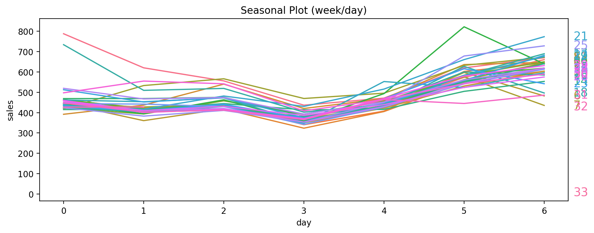
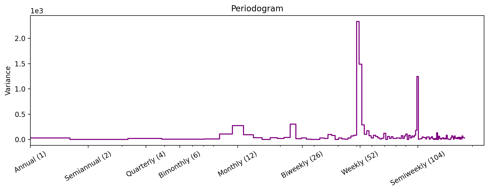
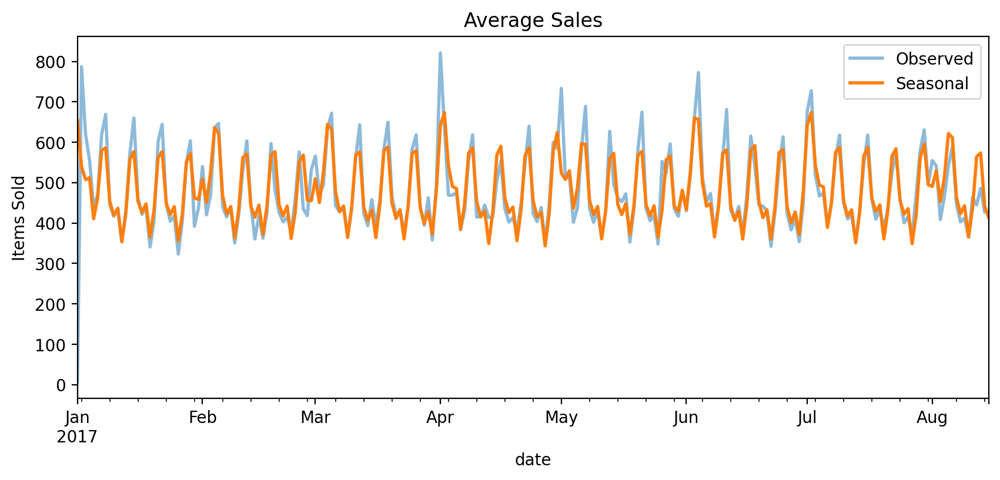
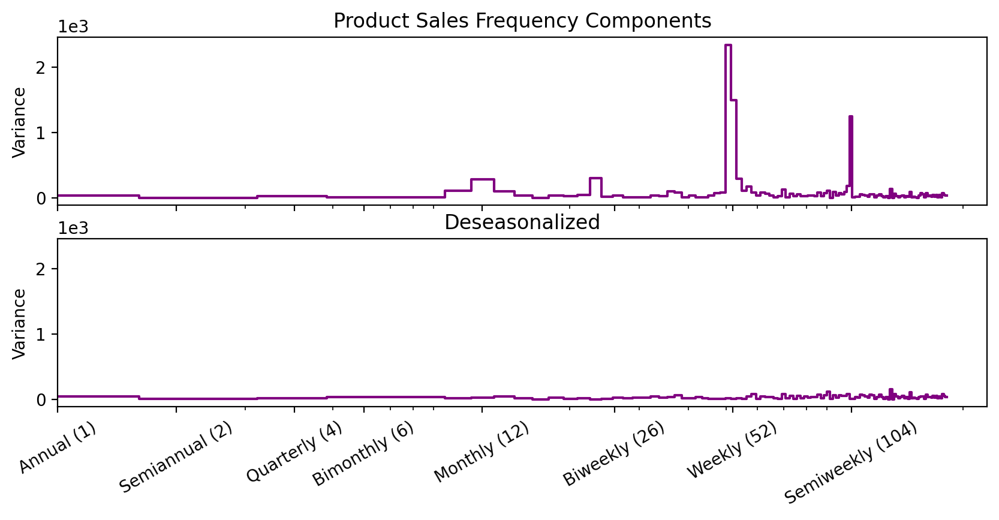
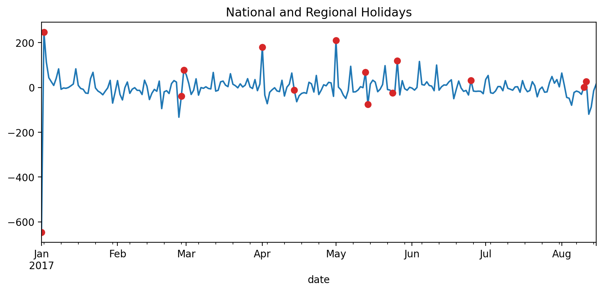
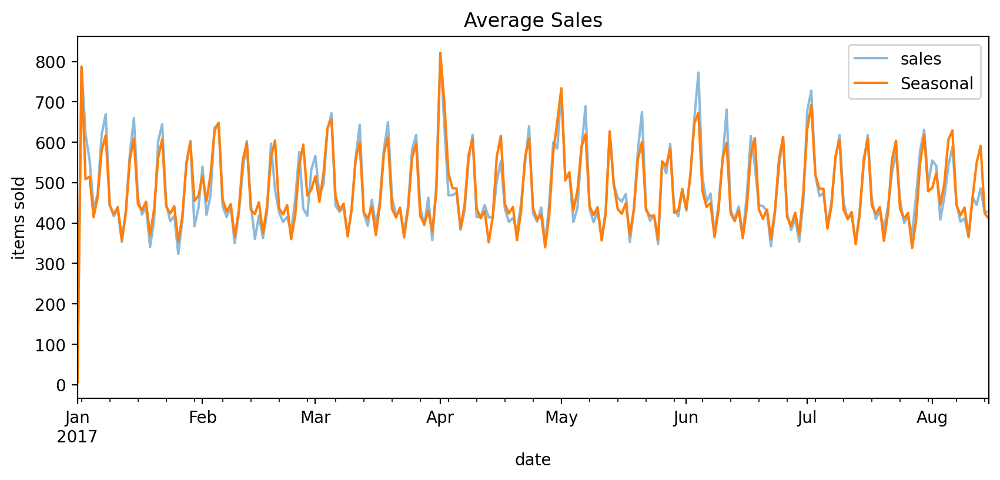

# Seasonality

This folder contains my solution to the **"Trend"** exercise from the [Kaggle Time Series Course](https://www.kaggle.com/learn/time-series).

The project demonstrates how to use indicator variables (one-hot encoding) and Fourier features to capture periodic changes in a time series.

---

## Workflow Summary

- **Import libraries**  
  Load all required Python libraries for data manipulation (`pandas`, `numpy`), visualization (`matplotlib`, `seaborn`), and modeling (`scikit-learn`, `statsmodels`).

- **Load datasets**  
  Import `train.csv` (store sales on  https://www.kaggle.com/learn/time-series) and `holidays_events.csv`, preprocess dates, and create suitable indexes (`PeriodIndex` and `DatetimeIndex`).

- **Explore seasonality**  
  Use seasonal plots and periodograms to identify weekly and monthly cycles.

- **Build features**  
  - Add **seasonal indicators** (dummies for weeks, days, or holidays).  
  - Create **Fourier features** (pairs of sine and cosine terms for smooth seasonal cycles).  

- **Fit regression model**  
  Train a linear regression model with deterministic features (trend, Fourier, indicators).  

- **Evaluate and visualize**  
  Compare fitted values against observed data, plot deseasonalized series, and highlight the impact of holidays.  

---

## Key Takeaways

- Seasonal indicators are binary features that represent seasonal differences in the level of a time series.  
- Seasonal indicators are what you get if you treat a seasonal period as a categorical feature and apply one-hot encoding.  

- Fourier features are better suited for long seasons over many observations where indicators would be impractical.  
  Instead of creating a feature for each date, Fourier features try to capture the overall shape of the seasonal curve with just a few features.  

- Fourier features are pairs of sine and cosine curves, one pair for each potential frequency in the season starting with the longest.  
  For example, Fourier pairs modeling annual seasonality would have frequencies: once per year, twice per year, three times per year, and so on.  

- Both the seasonal plot and the periodogram suggest a strong **weekly seasonality**.  
  From the periodogram, it appears there may also be some **monthly and biweekly** components.  

---

## Visualizations

### Seasonal Plot
Shows day-to-day sales patterns within weeks.  

### Periodogram
Identifies dominant frequency components.  

### Observed vs Fitted
Regression fit with Fourier + indicators.  

### Deseasonalized Comparison
Original vs deseasonalized frequency spectrum.  

### Holidays Effect
Deseasonalized series with holidays highlighted.  

### Seasonal + Holiday Model
Fitted model including holiday effects.  

---

## Sample Holiday Data (2017)

| date       | description                          |
|------------|--------------------------------------|
| 2017-01-01 | Primer dia del ano                   |
| 2017-01-02 | Traslado Primer dia del ano          |
| 2017-02-27 | Carnaval                             |
| 2017-02-28 | Carnaval                             |
| 2017-04-01 | Provincializacion de Cotopaxi        |
| 2017-04-14 | Viernes Santo                        |
| 2017-05-01 | Dia del Trabajo                      |
| 2017-05-13 | Dia de la Madre-1                    |
| 2017-05-14 | Dia de la Madre                      |
| 2017-05-24 | Batalla de Pichincha                 |
| 2017-05-26 | Traslado Batalla de Pichincha        |
| 2017-06-25 | Provincializacion de Imbabura        |
| 2017-08-10 | Primer Grito de Independencia        |
| 2017-08-11 | Traslado Primer Grito de Independencia |

---

