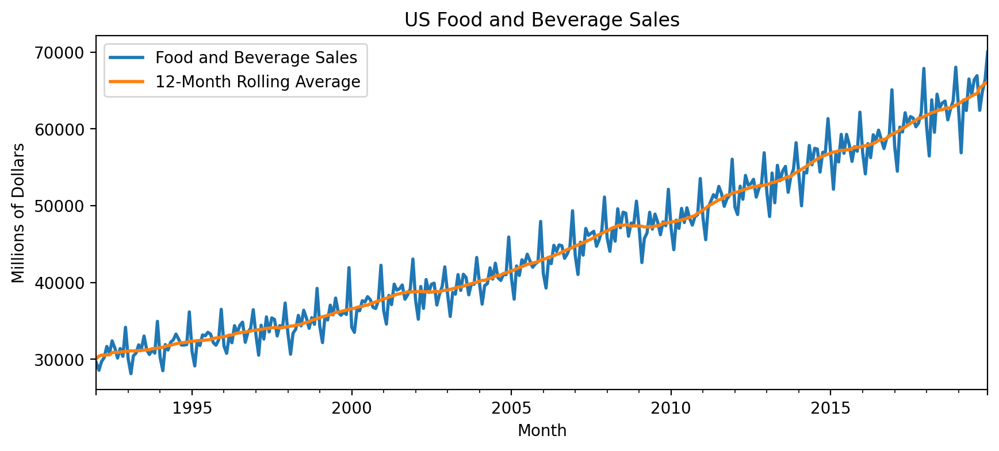
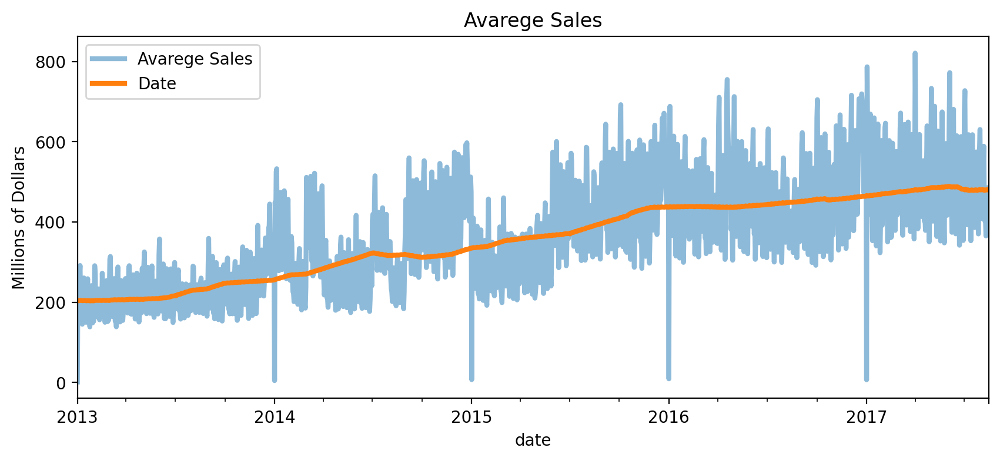
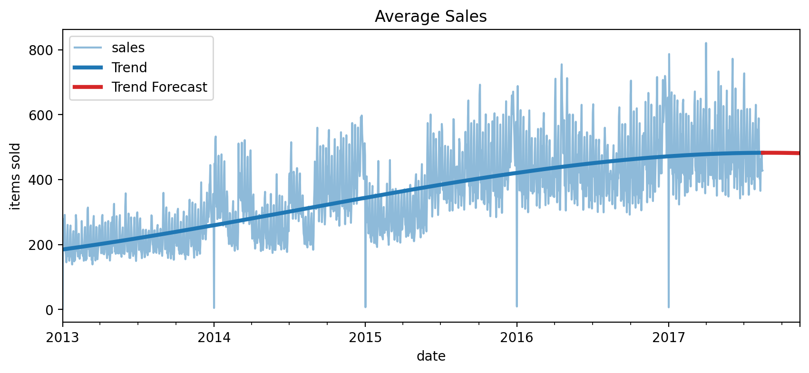
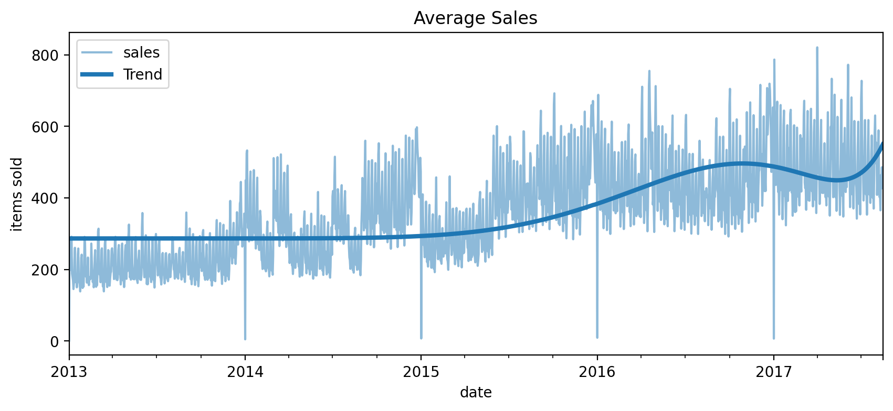
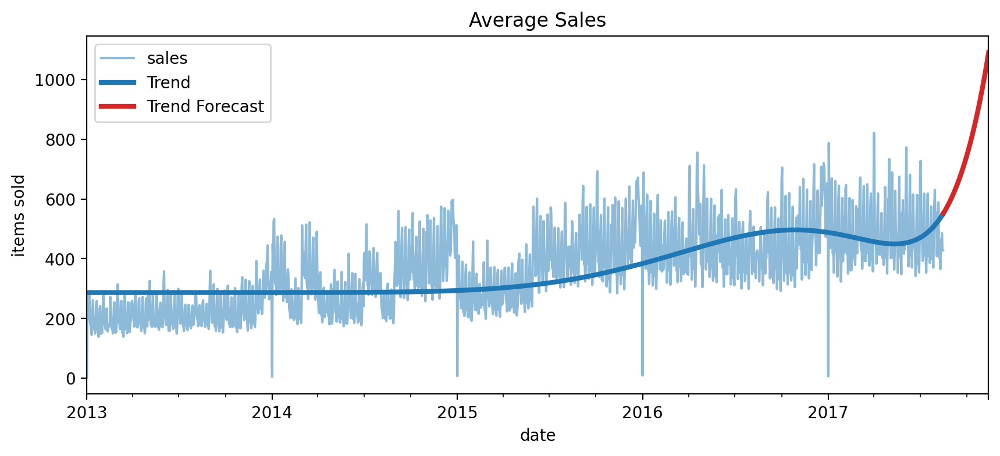

## Trend

This folder contains my solution to the **"Trend"** exercise from the [Kaggle Time Series Course](https://www.kaggle.com/learn/time-series).

The project demonstrates how to model long‑term changes using moving averages and a time index (time dummy).

## Workflow Summary

- **Import libraries**

- **US Retail Sales Dataset**
  - Load US Retail Sales data with "Month" as the index (parsed as datetime).
  - Create a features FoodAndBeverage and Automobiles

- **Store Dales Dataset**
  - Load store sales data with optimized dtypes for efficiency
  - Convert the index to a daily `PeriodIndex`.
  - Add store number and product family as additional index levels (MultiIndex).
  - Aggregate mean sales across all stores/families per day.

## Experiments

**1. Moving Average on Food and Beverage Sales**

- Visualize the moving average onn Food and Beverage Sales.  

---

**2. Moving Average on Avarege Sales**

- Visualize the 365‑day moving average on Avarege Sales.  

---

**3. Cubic Trend Forecast**

- Use `DeterministicProcess` to create a feature set for a **cubic** trend model
- Create out‑of‑sample features for a 90‑day forecast.
- Fit a linear regression to predict sales over time.
- Predict and plot the in‑sample trend and the 90‑day forecast.

- Visualization:  

---

**4. 11th‑Order Polynomial Trend + Forecast**

- Use `DeterministicProcess` to create features for an **11th‑order** polynomial trend.
- Visualize the fitted in‑sample trend.  

- Create out‑of‑sample features for a 90‑day forecast and visualize it.  
- Visualize the order 11 90-day forecast.  

---

## Key Takeaways

The trend component of a time series represents a persistent, long-term change in the mean of the series.

The trend is the slowest-moving part of a series, the part representing the largest time scale of importance.